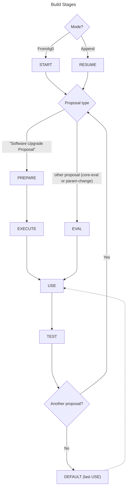

# agoric-3-proposals

Proposals run or planned for Mainnet (agoric-3)

This repo serves several functions:

- verify building an image with in which known proposals have executed
- publishing an image with all passed proposals
- verify that certain tests pass after each proposal

## Usage

You can run the latest image like so,

```sh
docker run -p 26657:26657 -p 1317:1317 -p 9090:9090 ghcr.io/agoric/agoric-3-proposals:latest
```

The `-p` is short for [publish](https://docs.docker.com/network/#published-ports) to make the `agd` [daemon's ports](https://docs.cosmos.network/v0.46/core/grpc_rest.html) available on your host machine:

| Port  | Purpose                 |
| ----- | ----------------------- |
| 1317  | REST server             |
| 9090  | gRPC server             |
| 26657 | Tendermint RPC endpoint |

## Design

The build is [multi-stage](https://docs.docker.com/build/building/multi-stage/) with several kinds of stages as implemented by [dockerfileGen.ts](./packages/synthetic-chain/src/cli/dockerfileGen.ts).

<details><summary>Build stage sequence</summary>



</details>

| Stage Type | Scope                            | Description                                                                                                                                                                                       |
| ---------- | -------------------------------- | ------------------------------------------------------------------------------------------------------------------------------------------------------------------------------------------------- |
| START      | base                             | The very first stage, which run `ag0` instead of `agd` as the other layers do. (This was the version of `agd` before JS VM.)                                                                      |
| PREPARE    | chain software upgrade proposals | submits the proposal, votes on it, runs to halt for the next stage                                                                                                                                |
| EXECUTE    | chain software upgrade proposals | starts `agd` with the new SDK, letting its upgrade handler upgrade the chain                                                                                                                      |
| EVAL       | other proposals                  | submits the proposal, votes on it, and begin executing. Does not guarantee the eval will finish but does wait several blocks to give it a chance.                                                 |
| USE        | all proposals                    | Perform actions to update the chain state, to persist through the chain history. E.g. adding a vault that will be tested again in the future.                                                     |
| TEST       | all proposals                    | Test the chain state and perform new actions that should not be part of history. E.g. adding a contract that never was on Mainnet.                                                                |
| DEFAULT    | tip                              | Run the last USE image with entrypoint `./start_agd.sh`, invoking the chain node with all passed proposals and no termination condition. This is a convenient base for further derivative images. |

`TEST` stages do not RUN as part of the build; they only copy test files into the image and define [ENTRYPOINT](https://docs.docker.com/reference/dockerfile/#entrypoint).
CI runs those entrypoints to execute the tests.
(Note that some other phases use tests too, for example to pre-test, so files like `pre.test.js` are always copied. Only `test.sh` and a `test` dir are excluded from stages before TEST.)

The `USE` stage is built into images that are pushed to the image repository. These can be used by release branches to source a particular state of the synthetic chain.

## Proposals

### Types

- Software Upgrade à la https://hub.cosmos.network/hub-tutorials/live-upgrade-tutorial
- Core Eval à la https://github.com/Agoric/agoric-sdk/tree/master/packages/vats/src/core
- Not yet supported: combo Upgrade/Eval

### Naming

Each proposal is defined as a subdirectory of `proposals`. E.g. `16:upgrade-8`.

The leading number is its number as submitted to the agoric-3 chain. These are viewable at https://bigdipper.live/agoric/proposals

The string after `:` is the local label for the proposal. It should be distinct, concise, and lowercase. (The string is used in the Dockerfile in a token that must be lowercase.)

If the proposal is _pending_ and does not yet have a number, use a letter. The proposals are run in lexical order so all letters execute after all the numbers are done.

### Files

All files are optional other than `package.json` and `test.sh`.

- `package.json` must include an object-valued `agoricProposal` field with a `type` property specifying the type of proposal (one of "/cosmos.params.v1beta1.ParameterChangeProposal", "/agoric.swingset.CoreEvalProposal", or "Software Upgrade Proposal"). `agoricProposal` may also include other properties (e.g., `upgradeInfo` as used by [agoric-sdk/a3p-integration](https://github.com/Agoric/agoric-sdk/tree/7ed74d76185ae163c4df6254e8ff6b76cfac56ce/a3p-integration)), and if the type is "Software Upgrade Proposal" then it MUST include
  - `planName`: the cosmos-sdk "upgrade name" to target
  - `releaseNotes`: a URL to e.g. `https://github.com/Agoric/agoric-sdk/releases/tag/$releaseName`, or `false` for an unreleased upgrade
  - `sdkImageTag`: the tag to use for the output Docker image
- `prepare.sh` is executed while the chain node is running but before the proposal is submitted.
- `eval.sh` is executed in the EVAL stage while the chain node is running, as a replacement of default behavior based on `submission/`.
- `submission/` is scanned for $name.js core-eval proposal scripts, corresponding $name-permit.json permits, and referenced b1-$hash.json bundles. [Default EVAL stage behavior](https://github.com/Agoric/agoric-3-proposals/blob/main/packages/synthetic-chain/public/upgrade-test-scripts/eval_submission.js) installs the bundles and submits a core-eval proposal referencing all of the ($name-permit.json, $name.js) pairs.
- `use.sh` is executed in the USE stage while the chain node is running.
- `setup-test.sh` is executed in the TEST stage _before_ the chain node is started.
- `test.sh` is executed in the TEST stage while the chain node is running.
- `teardown-test.sh` is executed in the TEST stage _after_ the chain node is stopped.
- `test/` is copied into the TEST stage image for use by other files.
- `host/before-test-run.sh` is executed on the Docker _host_ before launching a container for the TEST stage (useful for e.g. starting a follower).
- `host/after-test-run.sh` is executed on the Docker _host_ after a container for the TEST stage exits (useful for e.g. stopping a follower).

## Development

### Top-level commands

```sh
# build the "use" images (both platforms used),
yarn build

# build test images (current platform) and run them:
yarn test

# run the tests for particular proposals,
yarn test --match upgrade

# debug the tests for one proposal,
yarn test --debug --match upgrade-13
```

## synthetic-chain package

To use a local build of synthetic-chain,

```sh
cd packages/synthetic-chain
npm pack
cd -

for p in $(ls proposals); do
    cp -f packages/synthetic-chain/agoric-synthetic-chain-*.tgz proposals/$p/agoric-synthetic-chain.tgz
    cd proposals/$p
    yarn install
    cd -
done
rm -f packages/synthetic-chain/agoric-synthetic-chain-*.tgz
```

Then find-replace the "@agoric/synthetic-chain" version in package.json with ""file:agoric-synthetic-chain.tgz".

## Debugging

To get the local files into the container, use a [bind mount](https://docs.docker.com/storage/bind-mounts/). E.g.

```sh
docker run -it --entrypoint bash --mount type=bind,src=.,dst=/usr/src/a3p ghcr.io/agoric/agoric-3-proposals:use-upgrade-8
```

### Common errors

`yarn doctor` can diagnose (and fix!) a number of common problems.

#### JS exception

If running `yarn synthetic-chain` throws an exception, it may because the Node version is too old. The `@agoric/synthetic-chain` package declares its "engines" range, but Yarn ignores it when running the bin in this repo. Be sure your Node version is compatible with the range.

The easiest way to do that is to use a Node version manager that honors the `.node-version` file at the top level of the repo. [nodenv](https://github.com/nodenv/nodenv) does. If you prefer nvm, you may need [avn](https://github.com/wbyoung/avn).

#### Consensus failure

This one reports as failure, but it's actually the mechanism for triggering a chain-halting upgrade:

```text
CONSENSUS FAILURE!!! err="UPGRADE \"agoric-upgrade-8\" NEEDED at height: 33: {}" module=consensus
```

But this one is a problem:

```text
ERR CONSENSUS FAILURE!!! err="runtime error: invalid memory address or nil pointer dereference" module=consensus
```

The most likely cause is a problem voting in the proposal to upgrade.

## Contributing

To add a proposal, see [CONTRIBUTING.md](./CONTRIBUTING.md).

## Images

This repo publishes an image of the synthetic agoric-3 chain with all proposals that have "passed" (defined in this repo as having a proposal number).

The CI builds on every push to the trunk branch, (`main`), or a PR branch. You can view all versions at https://github.com/agoric/agoric-3-proposals/pkgs/container/agoric-3-proposals/versions

PR builds don't push images.

The trunk build pushes "use" images for each proposal and a "latest" which points to the highest passed proposal: `ghcr.io/agoric/agoric-3-proposals:latest`.

If you RUN this image, you'll get a working chain running `agd` until you terminate,

```sh
docker run ghcr.io/agoric/agoric-3-proposals:latest
```

Or locally,

```sh
docker build -t ghcr.io/agoric/agoric-3-proposals:dev .
docker run  ghcr.io/agoric/agoric-3-proposals:dev
```

## Future work

- [ ] include a way to test soft patches that weren't proposals (e.g. PismoB)
- [ ] separate console output for agd and the scripts (had been with tmux before but trouble, try Docker compose https://github.com/Agoric/agoric-sdk/discussions/8480#discussioncomment-7438329)
- [ ] way to query capdata in one shot (not resorting to follow jsonlines hackery)
- [ ] within each proposal, separate dirs for supporting files so images don't invalidate
